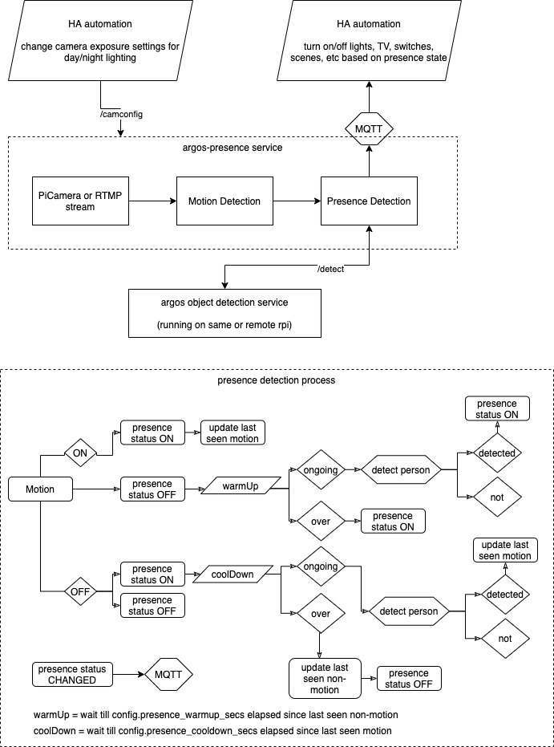
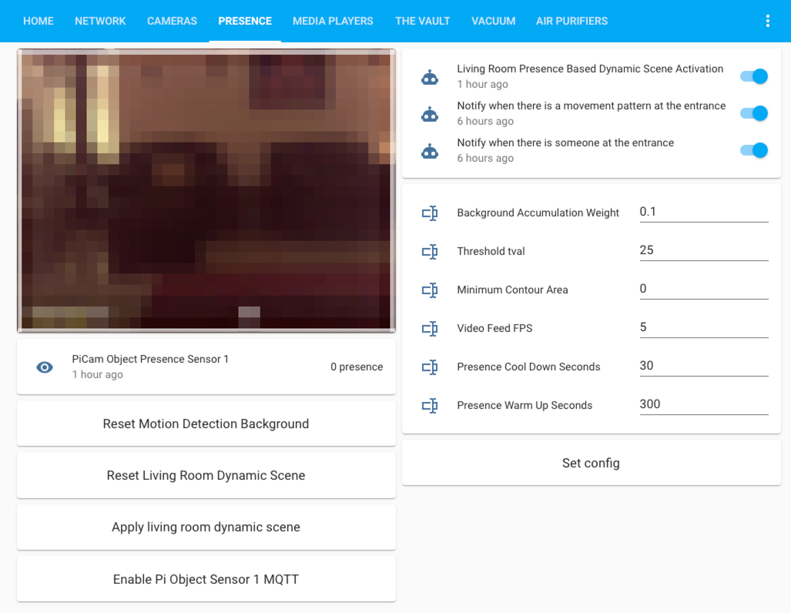

### Argos Room Presence
[](https://hub.docker.com/r/angadsingh/argos-presence)

This project builds a room presence solution on top of [Argos](https://github.com/angadsingh/argos). Using just a cheap raspberry pi zero w (plus an attached pi camera, or an RTMP enabled camera] in any room, this project provides a reliable, robust and efficient mechanism to detect if people are present in that room or not, allowing you to then use it as an MQTT sensor in [HomeAssistant](http://hass.io/) for automating lighting, media players, heating or what have you in that room, as a consequence.

#### Preface

For a long time, I've been trying to figure out a robust room presence solution for my home automation setup within [HomeAssistant](http://hass.io/). I've tried everything from [integrating](https://community.home-assistant.io/t/tuya-motion-sensor-is-not-supported-in-home-assistant/68109/68) simple battery operated wifi-connected PIR motion sensors to bluetooth LE based detection using a cluster of raspberry pi zero's running [room-assistant](http://room-assistant.io). It all works half of the time and then crumbles down like a house of cards rest of the time. After a lot of tinkering and tuning, I have now devised a solution, which I can confidently proclaim, is completely devoid of any false positives or false negatives, and works reliably in the real world. And trust me, when it comes to room presence, what matters is **false negatives!** Folks absolutely hate you when your fancy home automation turned off the TV and all the lights when everyone was tuned into that game/movie!

#### So, whats the secret sauce?

`argos-presence` provides reliable room presence by using **computer vision**. Forget all the thermal imaging sensors, PIR motion sensors and bluetooth scanning solutions. Raspberry Pi's can now run sophisticated computer vision algorithms and even machine learning algorithms (thank you [tensorflow lite]()!) thanks to all the performance advancements in both single board computers and advancements in [OpenCV](https://opencv.org/) and tensorflow. 

Here's how `argos-presence` works:



The executive summary is the following:

* Argos-presence is detecting movement (even the tiniest finger or facial movement), and then making sure the movement is actually a person when it matters.
* We dont simply set the `presenceStatus` based on motion. We have `warmUp` and `coolDown` periods.
* When `motion` tries to switch `presenceStatus` from on to off, we have a `coolDown` period where the argos object detection service is called to figure out if there's a person in the scene, and we keep extending the cool down till a person is detected. This is to avoid **false negatives**
* When `motion` tries to switch `presenceStatus` from off to on, we have a `warmUp` period where, again we detect if a person is present or not. This is to avoid **false positives**. For example, if your `presenceStatus` recently went from on to off, your lights are in the process of turning off, which can be seen as `motion` by the detector. If we did not have a `warmUp` period, your room would keep flipping the lights on and off continuously. Note: this doesn't mean you have to wait 30 seconds (warmUp seconds) for your lights to turn on. During warmup, it terminates the warmup and switches to presenceStatus ON immediately if a person is detected (and only if…). The warmUp period is only in effect after a recent change from presence to no presence (from last motion). The other times whenever you come into the room, argos will go into presence status immediately (with just motion). You can even turn off warmUp mode by setting warmUp seconds to 0.
* The warmup and cooldown periods need to be configured (sensible tried and tested defaults are already set in the [example config](configs/config_example.py)) to accommodate for your environment.
* In effect, your lights (or whatever you choose to turn on in your automation) will turn ON instantly, but they’ll take coolDown seconds (e.g. 5 minutes) to turn off and will ONLY turn off when there’s no computer vision detected human in the frame (so no false negatives - a big principle on which the project was built)

#### Installation

Depending on the deployment model you chose, you may have to install `argos` on the same device as `argos-presence` or on a different device. Follow the instructions to install argos [here](https://github.com/angadsingh/argos#installation). You still have to clone [argos](https://github.com/angadsingh/argos) and make it available in the `PYTHONPATH` as `argos-presence` uses it's motion detection API. This is done in the systemd service file [provided](argos_presence.service).

On your pi:

```bash
cd ~
git clone https://github.com/angadsingh/argos-presence
sudo apt-get install python3-pip
pip3 install --upgrade pip
sudo apt-get install python3-venv
python3 -m venv argos-presence-venv/
source argos-presence-venv/bin/activate
pip install wheel
pip install -r argos-presence/requirements.txt
```

install it as a systemd service:

```bash
sudo cp argos-presence/argos_presence.service /etc/systemd/system/
sudo systemctl daemon-reload
sudo systemctl enable argos_presence.service
sudo systemctl start argos_presence
```

see the logs

```bash
journalctl --unit argos_presence.service -f
```

###### As a docker container

You can use the following instructions to install argos-presence as a docker container.

*Install docker (optional)*

```bash
curl -fsSL https://get.docker.com -o get-docker.sh
sudo sh get-docker.sh
```

*Run argos-presence as a docker container*

Note: only docker images for armv7 (raspberry pi 2/3/4) and armv6 (raspberry pi zero/w) are provided. It should be trivial to support an amd64 dockerfile as well -armv6/v7 are much harder to figure out (contributions welcome!).

replace "armv7" with "armv6" in the below instructions for running on raspberry pi zero (/w)!

```bash
docker run --rm -p8000:8000 -v configs:/configs \
						-v /home/pi/motion_frames:/motion_frames angadsingh/argos-presence:arvmv7
						--config configs.your_config --camconfig configs.your_camconfig
```

make a systemd service to run it automatically. these services automatically download the latest docker image and run them for you:

```bash
sudo wget https://raw.githubusercontent.com/angadsingh/argos-presence/main/argos_presence_docker.service -P /etc/systemd/system/
sudo systemctl daemon-reload
sudo systemctl enable argos_presence_docker.service
sudo systemctl start argos_presence_docker
```

see the logs

```bash
journalctl --unit argos_presence_docker.service -f
```


#### Usage

You can run Argos Room Presence in the following modes of deployment:

| Deployment                              | Description                                                  | False positives | False negatives | Speed       |
| --------------------------------------- | ------------------------------------------------------------ | --------------- | --------------- | ----------- |
| *Standalone (not recommended)*          | You can use Argos Room Presence (this project) standalone on a cheap and little a device as raspberry pi zero w. It will only use the argos motion detection API to do room presence, and does not use the tensorflow ML based person detection (object detection). When people in the room don't move for the configured period, this will cause false negatives | None            | Sometimes       | Fast        |
| *Remote person detection (recommended)* | Run Argos Room Presence (this project) on a $15 rpi zero w (with an attached pi camera, which come as cheap as $8), configured to do person detection using a remote [Argos](https://github.com/angadsingh/argos) object detection [service](https://github.com/angadsingh/argos/blob/main/serve.py) running on atleast a raspberry pi 4, or nvidia jetson nano, or an old laptop or Mac mini (needs to be able to run tensorflow lite at decent FPS) | None            | **None**        | Faster      |
| *Local person detection (ideal)*        | Run both the Argos object detection [service](https://github.com/angadsingh/argos/blob/main/serve.py) as well as room presence (this project) on the same device. This avoids a network hop. You can use this mode if you don't intend to use a pi camera and can do presence detection from an existing RTMP camera in a room. | None            | **None**        | **Fastest** |

You can run room presence like this (although its best to run it as a systemd service as described in the installation section):

```bash
PYTHONPATH=$PYTHONPATH:/home/pi/argos presence.py --ip 0.0.0.0 --port 8000 --config config --camconfig camconfig
```

Just like argos, argos-presence also exposes:

* a flask server which serves a web page where you can see the motion and person detection happening in action
* an image and video feed for you to use as a camera in HA (more on that below)
* APIs to get current status, set config and even set PiCamera configuration dynamically

|Method|Endpoint|Description|
|----|---------------|-----|
|Browse|`/`|will show a web page with the real time processing of the video stream (shows `/video_feed`)|
|GET|`/status`|status shows the current load, motion status|
|GET|`/config`|shows the config|
|GET|`/config?<param>=<value>`|will let you edit any config parameter without restarting the service|
|GET|`/config`|shows the PiCamera config|
|GET|`/camconfig?<param>=<value>`|will let you edit any PiCamera config parameter without restarting the service|
|GET|`/image`|returns the latest frame as a JPEG image (useful in HA [generic camera](https://www.home-assistant.io/integrations/generic/) platform)|
|GET|`/video_feed`|streams an MJPEG video stream of the motion and person detector (useful in HA [generic camera](https://www.home-assistant.io/integrations/generic/) platform)|

#### Home Assistant Integration

Once `argos-presence` is up and running, streaming your picamera or RTMP camera feed, doing motion detection, doing local or remote object detection by calling the `argos` service or API, and sending presence state to HA via MQTT, you can create an MQTT sensor and automation in HA to act on that presence state

Create the MQTT sensor:

```yaml
sensor:
  - platform: mqtt
    name: "Argos Room Presence Sensor Living Room"
    state_topic: "home-assistant/argos-room-presence/living_room"
    unit_of_measurement: "presence"
```

a sample automation which turns on/off a scene in a room based on presence:

```yaml
alias: Living Room Presence Based Scene Activation
description: ''
trigger:
  - platform: state
    entity_id: sensor.argos_room_presence_sensor_living_room
    to: '1'
    from: '0'
  - platform: state
    entity_id: sensor.argos_room_presence_sensor_living_room
    from: '1'
    to: '0'
condition: []
action:
  - choose:
      - conditions:
          - condition: state
            entity_id: sensor.argos_room_presence_sensor_living_room
            state: '1'
        sequence:
          - scene: scene.living_room_on_scene
      - conditions:
          - condition: state
            entity_id: sensor.argos_room_presence_sensor_living_room
            state: '0'
        sequence:
          - scene: scene.living_room_off_scene
    default: []
mode: restart
```

one thing that we need to take care of is to accomodate for lighting changes during the day. `argos-presence` exposes a `/camconfig` API which lets you change any PiCamera property dynamically. We'll use this API to change the camera settings for day and night lighting changes. This is necessary, as otherwise argus won't be able to detect motion when the lights are off at night, for example. The below automation changes the exposure settings for the PiCamera at night such that it can see in low light as well! (you'll be surprised how well that $8 camera sees in low light with the right settings!)

```yaml
alias: Apply Argos Presence Dynamic Camera Settings
description: ''
trigger:
  - platform: time
    at: '17:30'
  - platform: time
    at: '06:30'
  - platform: homeassistant
    event: start
condition: []
action:
  - choose:
      - conditions:
          - condition: time
            after: '17:30'
            before: '06:30'
        sequence:
          - service: rest_command.argos_living_room_sensor_set_camconfig
            data:
              exposure_mode: 'off'
              framerate: 2
              iso: 0
              image_denoise: ''
              video_denoise: ''
              video_stabilization: ''
              shutter_speed: 499829
              meter_mode: spot
              exposure_compensation: 0
              awb_mode: 'off'
              awb_gains_red: 1.5625
              awb_gains_blue: 1.20703125
      - conditions:
          - condition: time
            after: '06:30'
            before: '17:30'
        sequence:
          - service: rest_command.argos_living_room_sensor_set_camconfig
            data:
              exposure_mode: auto
              framerate: 5
              iso: 0
              image_denoise: 1
              video_denoise: 1
              video_stabilization: ''
              shutter_speed: 0
              meter_mode: average
              exposure_compensation: 0
              awb_mode: auto
              awb_gains_red: 1
              awb_gains_blue: 1
    default: []
mode: single
```

for the above to work, we need to create some REST commands:

```yaml
rest_command:
  argos_living_room_sensor_reset_bg:
    url: 'http://<argos-presence-host>:8000/config?reset_bg_model=True'
    timeout: 120
  argos_living_room_sensor_set_config:
    url: "http://<argos-presence-host>:8000/config?bg_accum_weight={{ states('input_text.argos_presence_sensor_background_accumulation_weight') }}&min_cont_area={{ states('input_text.argos_presence_sensor_minimum_contour_area') }}&tval={{ states('input_text.argos_presence_sensor_tval') }}&video_feed_fps={{ states('input_text.argos_presence_sensor_video_feed_fps') }}&presence_cooldown_secs={{ states('input_text.argos_presence_sensor_presence_cooldown_secs') }}&presence_warmup_secs={{ states('input_text.argos_presence_sensor_presence_warmup_secs') }}&argos_person_detection_enabled={{ states('input_text.argos_presence_sensor_person_detection_enabled') }}&argos_detection_threshold={{ states('input_text.argos_presence_sensor_person_detection_threshold') }}&argos_detection_frequency_frames={{ states('input_text.argos_presence_sensor_person_detection_frequency_frames') }}"
    timeout: 120
  argos_living_room_sensor_set_camconfig:
    url: "http://<argos-presence-host>:8000/camconfig?exposure_mode={{exposure_mode}}&framerate={{framerate}}&iso={{iso}}&image_denoise={{image_denoise}}&video_denoise={{video_denoise}}&video_stabilization={{video_stabilization}}&shutter_speed={{shutter_speed}}&meter_mode={{meter_mode}}&exposure_compensation={{exposure_compensation}}&awb_mode={{awb_mode}}&awb_gains_red={{awb_gains_red}}&awb_gains_blue={{awb_gains_blue}}"
    timeout: 120
```

you can create a lovelace tab for managing argos configuration from HA itself. first create some input helpers to take in text input for the properties you want to be able to change from the UI and then use the following lovelace card. this uses the REST command created above for the `/config` API (not `/camconfig`):

```yaml
type: vertical-stack
cards:
  - type: entities
    entities:
      - entity: input_text.argos_presence_sensor_background_accumulation_weight
        name: Background Accumulation Weight
      - entity: input_text.argos_presence_sensor_tval
        name: Threshold tval
      - entity: input_text.argos_presence_sensor_minimum_contour_area
        name: Minimum Contour Area
      - entity: input_text.argos_presence_sensor_video_feed_fps
        name: Video Feed FPS
      - entity: input_text.argos_presence_sensor_presence_cooldown_secs
        name: Presence Cool Down Seconds
      - entity: input_text.argos_presence_sensor_presence_warmup_secs
        name: Presence Warm Up Seconds
  - type: button
    tap_action:
      action: call-service
      service: rest_command.argos_living_room_sensor_set_config
    name: Set config
```

it will look like this:


lastly, you can add the argo-presence video feed as a camera in home assistant! doing this you can then use a lovelace picture glance card to see your presence detector (doing motion detector and tensorflow based person detection) in action, and even record it's footage using motionEye, etc.

```yaml
camera:
- platform: mjpeg
    name: "Argos Living Room Presence Cam"
    still_image_url: "http://<argos-presence-host>:8000/image"
    mjpeg_url: "http://<argos-presence-host>:8000/video_feed"
```

add it to Lovelace:

```yaml
aspect_ratio: 0%
camera_image: camera.argos_living_room_cam
entities:
  - entity: camera.argos_living_room_cam
title: Living Room Presence Cam
type: picture-glance
```

here's how my presence tab looks like in lovelace:



#### Privacy

If you have privacy concerns about your presence camera video/image feed entering the network (and an attacker potentially getting access to it), then you can set the following config settings to completely disable the output frame

```python
self.output_frame_enabled = True
```

You may also want to install the argos object detector locally.